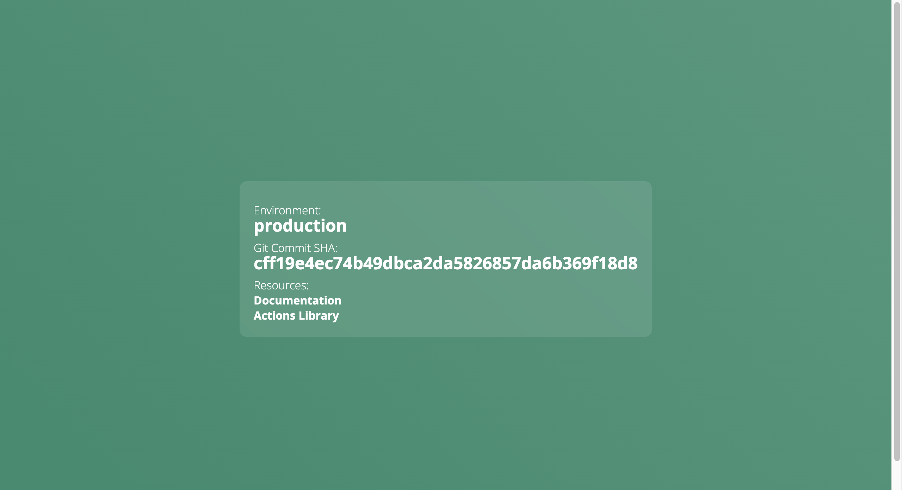

# CloudBees Sample Go App

This is a simple demo app that can be used to identify the different build versions of the application as well as the environment they are running in.

## How to build

A Dockerfile is included so you can build container images. Alternatively, you can use Go to build it using `go build`.

## How to run

Whether you run the binary directly, or through a container image, you can set the `ENVIRONMENT` environment variable to alter the name that appears in the application. The GitHub SHA is taken from the latest git commit as of building. 
